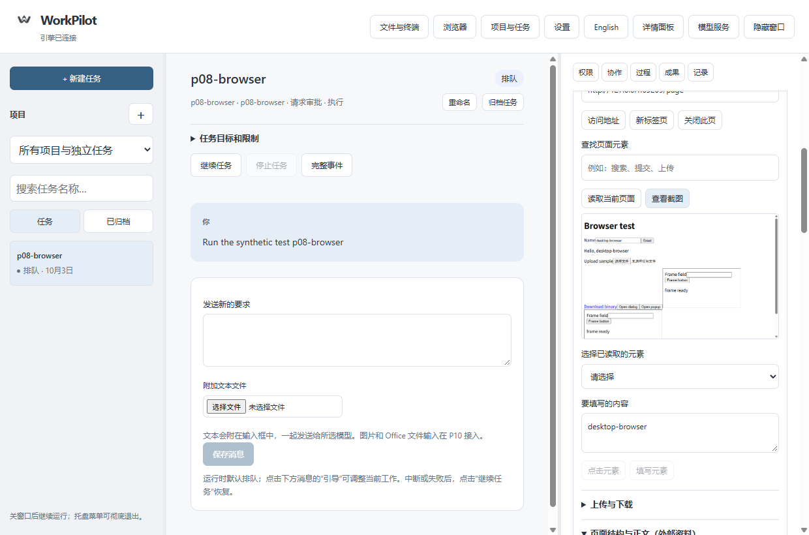
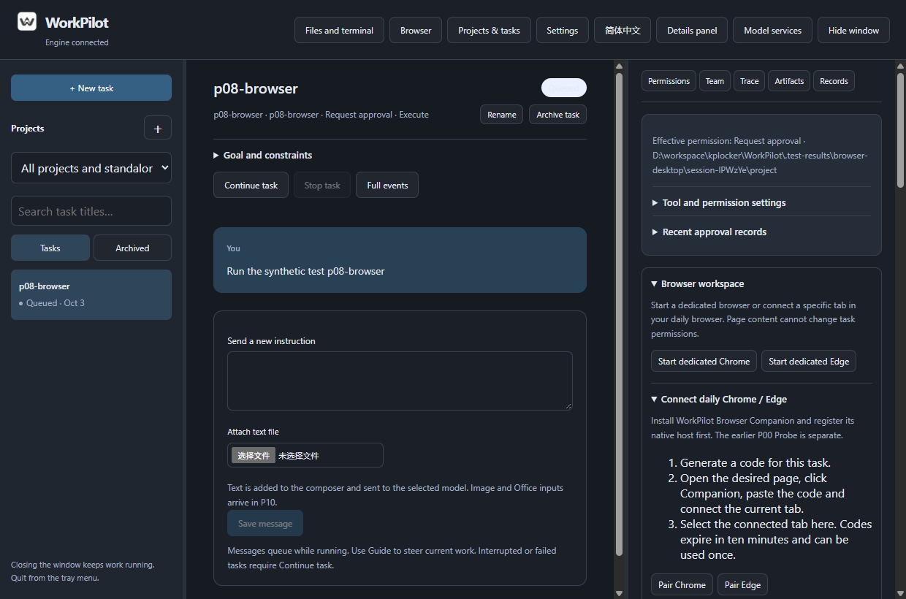

# WorkPilot P08 Windows 开发预览

本轮增加浏览器工作区：专用 Chrome/Edge、日常浏览器连接扩展、AI 页面操作、截图、文件上传下载，以及手动接管。Windows 本机自动检查与分发复测完成，日常 Chrome/Edge 新扩展的用户授权体验待集中确认；这还不是正式 V1。

## 打开效果

1. 从旧版 WorkPilot 托盘选择“彻底退出”。
2. 双击 [WorkPilot.exe](preview/WorkPilot.exe)，保留整个 preview 文件夹。
3. 选择已经绑定项目文件夹的任务，并使用执行模式，点击窗口顶部“浏览器”。
4. 点击“启动专用 Chrome”或“启动专用 Edge”。填写网址并访问；需要确认时到下面的操作记录点击“确认执行”。
5. 读取页面后可选择实际按钮/输入框进行点击、填写或查看截图。手工操作不调用模型；让 AI 操作仍需用户自己的可用模型配置。

审批由 AI 发起时，确认操作后点击“确认完成后继续 AI 任务”。可以尝试让 AI 打开专用浏览器、访问指定网页并阅读内容。登录和验证码请用“手动接管”，完成后显式恢复。

上传选择项目文件，最多 512 KiB；下载指定项目内保存路径，最多 8 MiB，并在“文件与终端”中保存修改历史。支持 HTTP(S) 下载链接；脚本生成、blob 和系统保存框等复杂下载用手动接管。

## 日常 Chrome 和 Edge

本机已准备并注册新的 Companion 连接程序，但没有替用户在日常浏览器中加载或授权。之前 P00 的 Browser Probe 仍保留。等用户方便时：

1. 分别打开 Chrome/Edge 的扩展管理页，开启开发者模式，加载项目的 [Companion 目录](../../extensions/companion/README.md)；名称 WorkPilot Browser Companion，版本 0.8.0。
2. 在 WorkPilot 的浏览器工作区生成对应浏览器连接码。
3. 在浏览器目标网页点击 Companion 图标，粘贴连接码，选择“连接当前标签页”。
4. 回到 WorkPilot 选择已连接页，先读页面再操作。每个任务有自己的控制范围，不包含旁边其它已经打开的标签页。

独立包另附 `preview/browser-companion/extension` 和 `register-chrome.cmd` / `register-edge.cmd`，可在其它 Windows 环境手工注册；脚本拒绝覆盖其它目录已有的 WorkPilot 登记，完整干净系统安装仍留 P12 验证。请不要把有效连接码贴给网站或第三方。

关闭 WorkPilot 窗口只隐藏，任务继续。彻底退出关闭专用浏览器、断开日常浏览器；日常浏览器本身保留。任务停止和相关权限变化会撤销连接，中断操作不会自动重放。

## 交付与证据

- [使用说明](preview/使用说明.txt)；[完整设计与容量](../../docs/development/P08-浏览器双通道.md)；[验证记录及待体验项](../../docs/development/P08-验证记录.md)。
- [源码与程序清单](source-and-binary-manifest.json)；[交付核对](evidence/delivery-verification.json)。程序包、Node.js 和浏览器辅助程序留本机，不纳入 Git；源码、文档和脱敏验证证据提交推送。
- 数据版本保持 7，原 P07 程序不覆盖。随包 Node.js 22.23.2 及许可证；Chrome/Edge 使用当前电脑安装版本，完整离线安装和更新仍属 P12。
- 专用通道实测 Chrome 154.0.8037.93、Edge 154.0.4258.48；扩展链路在官方隔离测试 Chromium 153.0.8010.12 实测。后者不代表用户日常浏览器授权验收通过。
- 没有本轮收费模型调用、macOS/Linux 实机、真实账号外部业务、浏览器升级过程、干净机器安装或四小时长跑结论。

