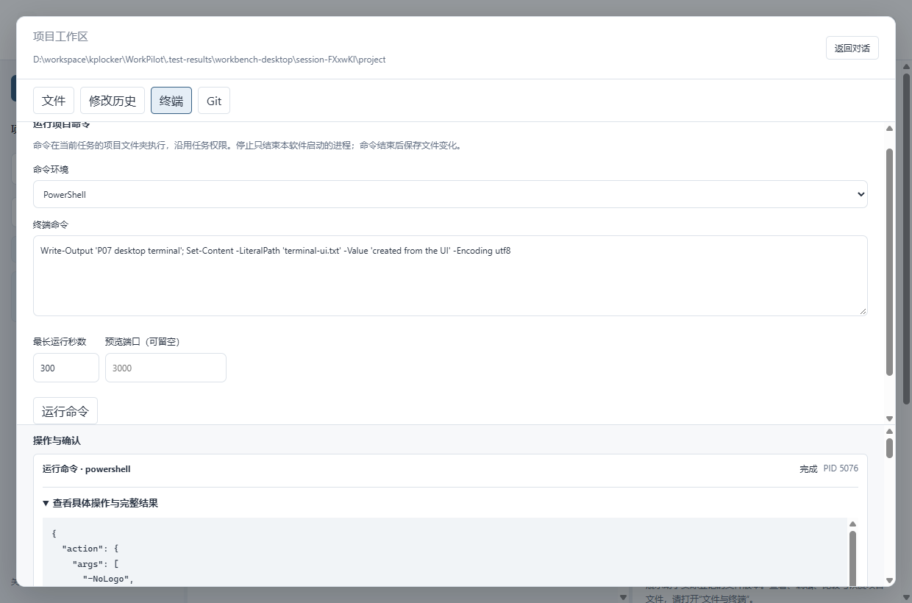
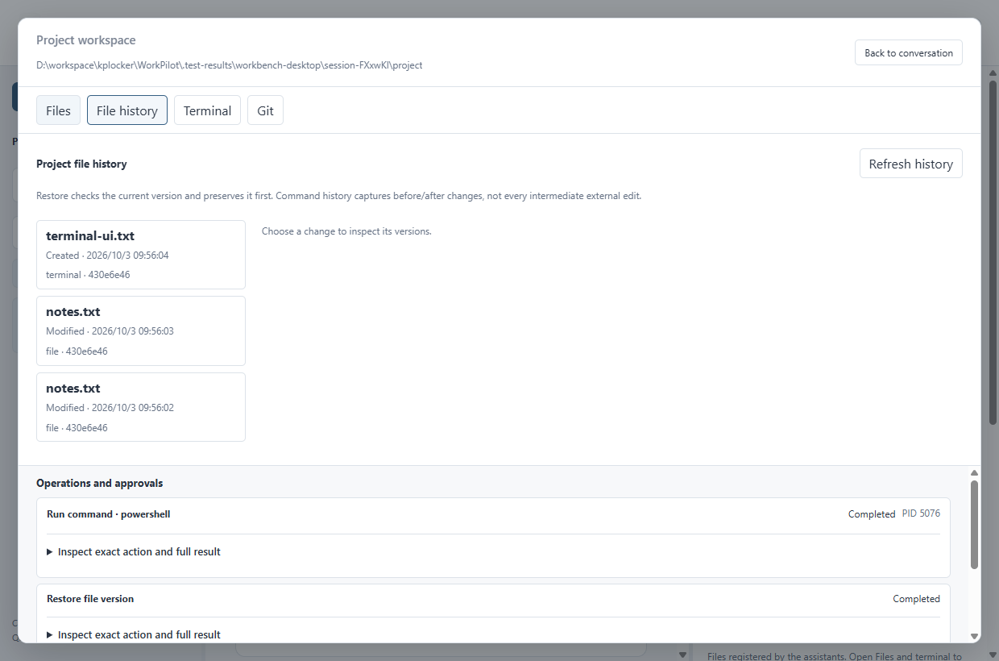
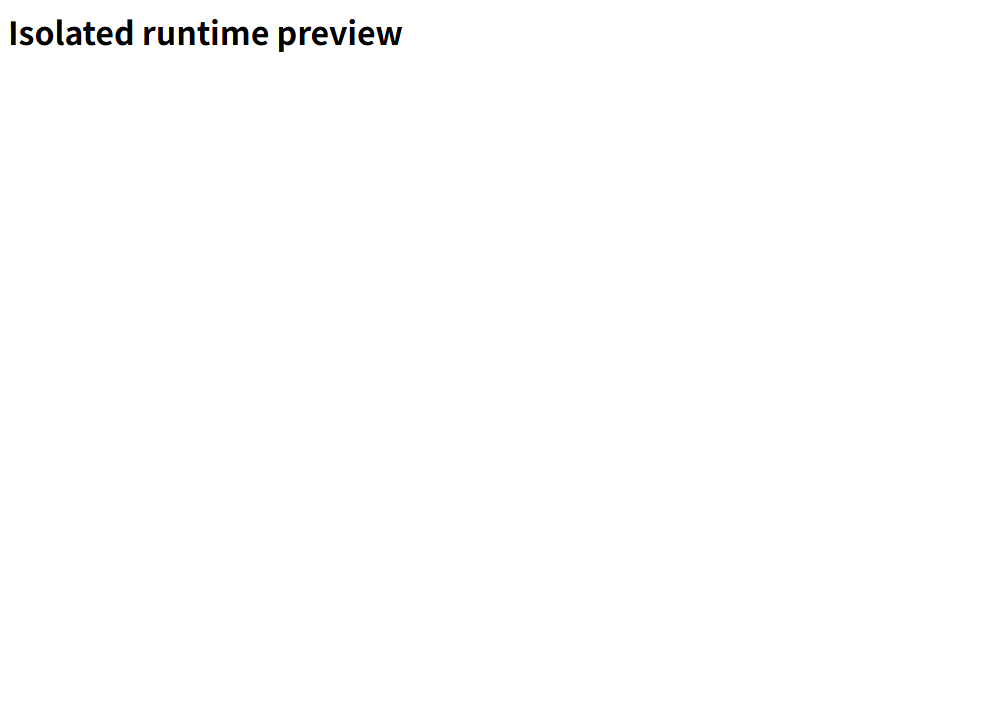

# P07 验证记录

日期：2026-10-03。环境：Windows 11 x64、Node 22.23.2、Rust 1.99。状态：实现与自动验证完成，待用户体验。本轮不使用收费模型密钥。

## 已执行的检查

| 检查 | 结果 | 证据 |
|---|---|---|
| Rust 自动测试 | 91 项通过；2 项显式忽略的既有集成/崩溃辅助测试不算通过 | [测试日志](../../artifacts/workpilot-p07-2026-10-03/evidence/rust-tests.txt) |
| 静态与前端 | 严格静态检查、类型、格式、构建；8 项 Node 本地服务测试 | [静态检查](../../artifacts/workpilot-p07-2026-10-03/evidence/clippy.txt)、[前端检查](../../artifacts/workpilot-p07-2026-10-03/evidence/checks.txt)、[服务测试](../../artifacts/workpilot-p07-2026-10-03/evidence/fixtures.txt) |
| P07 真实引擎 | 实际文件、Git、进程、文件版本与恢复；使用本机合成模型验证工具接入 | [报告](../../artifacts/workpilot-p07-2026-10-03/evidence/workbench-engine-report.json) |
| 网页界面 | 4 项通过，包含 P06/P07 接真实引擎以及 2 项基础预览 | [报告](../../artifacts/workpilot-p07-2026-10-03/evidence/ui-tests.txt) |
| Windows 原生桌面 | 9 组：编辑与确认、外部冲突、版本恢复、静态 HTML、PowerShell、中英布局、独立运行预览、端口失效、隐藏与退出 | [报告](../../artifacts/workpilot-p07-2026-10-03/evidence/workbench-desktop-report.json) |
| 独立分发目录 | 从 P07 预览目录再跑 9 组桌面场景，核验界面和配套引擎成套运行 | [分发复测](../../artifacts/workpilot-p07-2026-10-03/evidence/workbench-packaged-report.json)、[构建](../../artifacts/workpilot-p07-2026-10-03/evidence/build.txt) |
| P03/P04/P05 引擎回归 | 9 / 10 / 11 组通过；覆盖两助手同文件竞争、权限继承和整组停止恢复 | [P03](../../artifacts/workpilot-p07-2026-10-03/evidence/p03-engine-regression.json)、[P04](../../artifacts/workpilot-p07-2026-10-03/evidence/p04-engine-regression.json)、[P05](../../artifacts/workpilot-p07-2026-10-03/evidence/p05-engine-regression.json) |
| 交付核对 | 新包源码/程序校验、文档链接、旧 P06 程序未变 | [交付检查](../../artifacts/workpilot-p07-2026-10-03/evidence/delivery-verification.json) |

以上为本机结果，不等于远程 CI 已执行；未使用模拟结果代替实际文件、Git 和桌面操作。模型仅用本机固定测试服务生成工具调用，不新增任何真实供应商兼容结论。

## 关键场景

1. 中文、空格、长文件名可以保存；同一文件不同大小写路径上的过期版本被拒绝；3 MiB 二进制删除后逐字节恢复，超过 64 MiB 明确拒绝。
2. 外部编辑发生后，原审批失效、磁盘新内容保留。两个同时到达的确认只产生一次修改；恢复先记录当前版本。
3. Windows 特定文件私有访问规则在保存和恢复后保持一致；Unix 权限测试已提供，但本轮未在 Unix 运行。
4. 合成敏感内容的版本字节能原样读取，但不明文出现在版本库和数据库中；普通执行记录仍脱敏。
5. 真实脚本新增、重命名、删除文件后，有前后可恢复版本；模型 write_file 与 run_command 接入同一历史入口。
6. Git 只提交两项指定变化，旁边已经暂存和未暂存的用户修改均保留；含方括号的文件名按字面匹配，没有扩大成通配选择；不推送。
7. 本次创建的服务可预览、可停止，无关进程保持运行。停止耗时记录为单次本机样本，不是正式性能分位数。
8. 强制终止测试引擎后，重新打开补记已观察到的文件变化，不重放原命令。
9. 原生预览页面尝试调用宿主命令被实际拒绝，包括引擎命令及关闭宿主预览；静态 HTML 脚本不能执行。
10. 大输出对象在垃圾回收及完整记录导出后仍可读取；64 条近期记录之外的运行操作仍阻止归档，审批消费结果可跨重启保留。

## 发现并修正的问题

- schema 从 6 升到 7 后，旧迁移故障测试的注入版本不再是未来版本。改为当前版本加一，继续验证回滚与完整性；不能把原失败记成产品迁移失败。
- Windows 标准目录与带扩展前缀的目录字符串不一致，最初导致版本库测试拒绝自己的对象。改为在边界统一规范路径；系统程序不再错误进入目录授权处理。
- AppContainer 中 PowerShell 自己的当前目录退回系统盘，第一次真实终端写入失败。验证后改为仅挂载已授权项目目录的 PowerShell 盘符，原生与网页命令复测通过。见 [目录探查](../../artifacts/workpilot-p07-2026-10-03/evidence/powershell-directory-probe.json)。
- 初次界面恢复测试未等待落盘完成就读取历史，产生测试竞争；改为等待实际完成状态及两条版本记录。
- 初次加密文件检查把测试数据目录少拼了一层 test，导致找不到目录。修正测试路径后检查真实密文和数据库，未改变产品数据位置。
- 新 ACL 测试最初受到本机 PowerShell 模块路径影响，尚未运行到待测文件操作。测试改用系统文件权限接口，随后验证实际私有规则保留。见 [原失败](../../artifacts/workpilot-p07-2026-10-03/evidence/acl-fixture-first-failure.json)。
- 加固最终输入与输出引用归属、旧操作占用判断、单次审批和完整替换权限；对应自动测试通过。

保留最初引擎失败记录：[首次失败](../../artifacts/workpilot-p07-2026-10-03/evidence/engine-first-failure.json)。最终通过报告与失败报告分开存放，不覆盖后声称“从未失败”。

## 截图

## 集中待用户体验及未覆盖项

- 有空时体验文件树、编辑保存、外部修改提示、版本比较与恢复、终端停止，以及 Git 所选提交。自动测试通过不替用户确认操作是否顺手。
- 外部应用打开和原生文件夹操作仍保留人工体验；本轮测试不改用户系统默认应用。
- 内置终端不支持持续交互输入；长服务运行期间该项目其它写入排队。当前版本边界与上限见 [设计说明](P07-文件历史与开发工作区.md)。
- 不保证任意外部程序的每次瞬间改写，不覆盖项目外磁盘和已排除目录。二进制内部内容预览、插件和浏览器下载分别按 P10/P09/P08 接入验收。
- macOS/Linux 实机、跨机器加密版本迁移、版本保留清理、长期运行与正式性能指标仍未验证。只给 Windows 结论。
- Q44 通知方式依旧未确认。本轮没有改变产品方向或发布范围。

## 复测命令

从仓库根目录运行 npm run test:workbench-engine、npm run test:ui。先执行 npm run build，再运行 npm run test:workbench-desktop。设置 WORKPILOT_DESKTOP_BINARY 可针对独立分发程序复测；测试会建立专用临时数据目录，不使用正常任务数据库。

交付生成与核对使用 scripts/package-p07.mjs 和 scripts/verify-p07.mjs。测试证据随本次源码提交；程序由忽略规则留在本机。阶段保持“待用户体验”，下一实现阶段 P08。
